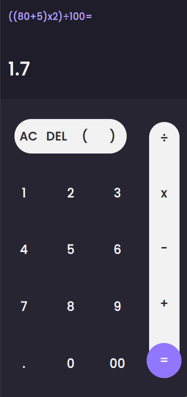

# Javascript Calculator
this calculator has been made using only pure vanilla HTML, CSS & javascript, and it can calculate the result by using advantage of the eval function in javascript
# Screenshot
that's how it looks on mobiles displays

# Features
**just a basic little cute calculator. don't expect much**
# Implemented Technologies
* vanilla **HTML**
* vanilla **CSS**
* vanilla **JavaScript**
* Progressive web app (**PWA**)
# License
This Project Is Licensed Under **WTFPL**

WTFPL &copy; [OussamaKamili](https://github.com/oussamakami/javascript-calculator/blob/master/LICENSE)